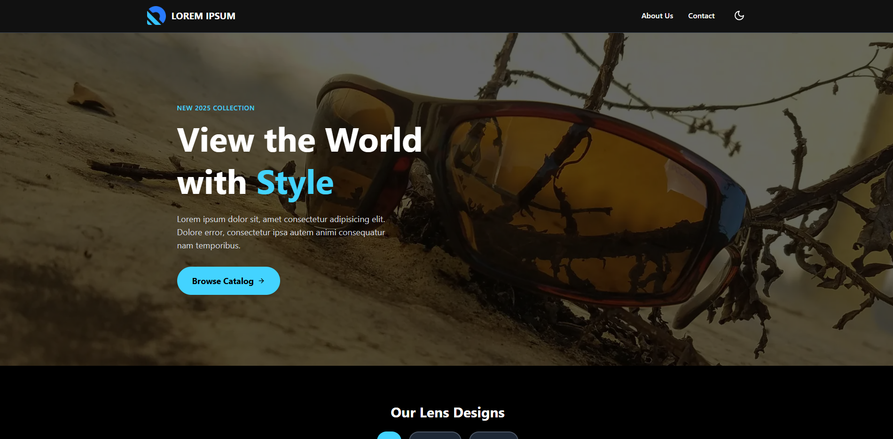

A modern, performant, and fully-featured e-commerce catalog built with a headless architecture. This project was designed to replace a static PDF catalog with a dynamic, easy-to-manage web experience, showcasing a fictional sunglasses brand.

**[View Live Demo](#)**

---

## ✨ Features

- **Dynamic Content:** All products, categories, and colors are managed through the **Sanity.io** headless CMS. The catalog can be updated in real-time without touching any code.
- **Light & Dark Mode:** A theme switcher with persistence, remembering the user's choice in their browser via `localStorage`.
- **Advanced Filtering:** Filter the product grid by selecting one or multiple categories simultaneously.
- **Pagination:** The product grid is paginated to handle a large number of products efficiently, ensuring fast initial load times.
- **Interactive Product Cards:**
  - Hover-to-preview different color variants directly from the main grid.
  - Limited color swatches are shown, with a "+x" indicator for products with many options.
- **Product Detail Page:**
  - **Magnifying Glass Zoom:** An interactive image zoom that follows the cursor to inspect product details.
  - **URL State Sync:** The selected color variant is stored in the URL, allowing users to share links to specific product versions.
- **Functional Contact Form:** A fully working contact form that sends emails to the site administrator using **Resend**.
- **Fully Responsive Design:** A clean, minimal UI built with Tailwind CSS that works seamlessly across all devices.
- **Optimized for Performance:** Built with Next.js (App Router) for fast page loads and a smooth user experience.

## 🛠️ Tech Stack

- **Frontend:** [Next.js](https://nextjs.org/) (App Router), [React](https://react.dev/), [TypeScript](https://www.typescriptlang.org/)
- **Styling:** [Tailwind CSS](https://tailwindcss.com/)
- **Headless CMS:** [Sanity.io](https://www.sanity.io/)
- **Email Service:** [Resend](https://resend.com/)
- **Deployment:** [Vercel](https://vercel.com/)

---

### Prerequisites

- Node.js (v18 or later)
- npm or yarn

### Installation & Setup

1.  **Clone the repository:**

    ```bash
    git clone https://github.com/joaquinsegura/catalog-one.git
    ```

2.  **Navigate to the project directory:**

    ```bash
    cd catalog-one
    ```

3.  **Install NPM packages:**

    ```bash
    npm install
    ```

4.  **Set up environment variables:**
    - Create a new file named `.env.local` in the root of the project.
    - Copy the contents of `.env.example` into your new `.env.local` file.
    - Fill in the required values for your Sanity project and Resend API key.

5.  **Run the development server:**
    ```bash
    npm run dev
    ```

Open [http://localhost:3000](http://localhost:3000) with your browser to see the live site.
The Sanity Studio is available at [http://localhost:3000/studio](http://localhost:3000/studio).

### Environment Variables

You will need to create a `.env.local` file in the root of the project and add the following variables:

```
# Sanity.io Environment Variables
NEXT_PUBLIC_SANITY_PROJECT_ID="your_project_id"
NEXT_PUBLIC_SANITY_DATASET="production"

# Resend API Key
RESEND_API_KEY="re_your_api_key"
```

---

## 🌐 Deployment

This project is configured for easy deployment on [Vercel](https://vercel.com/).

1.  Push your code to your GitHub repository.
2.  Connect your GitHub repository to Vercel.
3.  Add the same environment variables from your `.env.local` file to the Vercel project settings.
4.  Vercel will automatically build and deploy your site.
